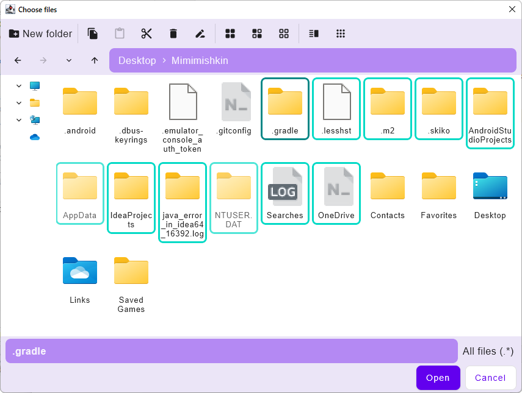

# Compose file chooser

### Short description
It's simple file chooser in material design that was designed just for my personal needs.

It supports:
1. file selection
2. directory selection
3. multiselection
4. table and grid representation
5. actions like "new folder", "delete", "copy/paste"
6. filters
7. unfortunately **not** selection by drag

### Sample
Sourse code:

    fun main() = singleWindowApplication {
        var isVisible by remember { mutableStateOf(true) }
        val chosen = remember { mutableListOf<File>().toMutableStateList() }

        if (isVisible) {
            ChooserDialog(
                settings = defaultChooserSettings(mode = OnlyFiles),
                onChosen = { chosen += it; isVisible = false }
            )
        }

        Column {
            chosen.forEach {
                Text(it.path)
            }
        }
    }

Result:

